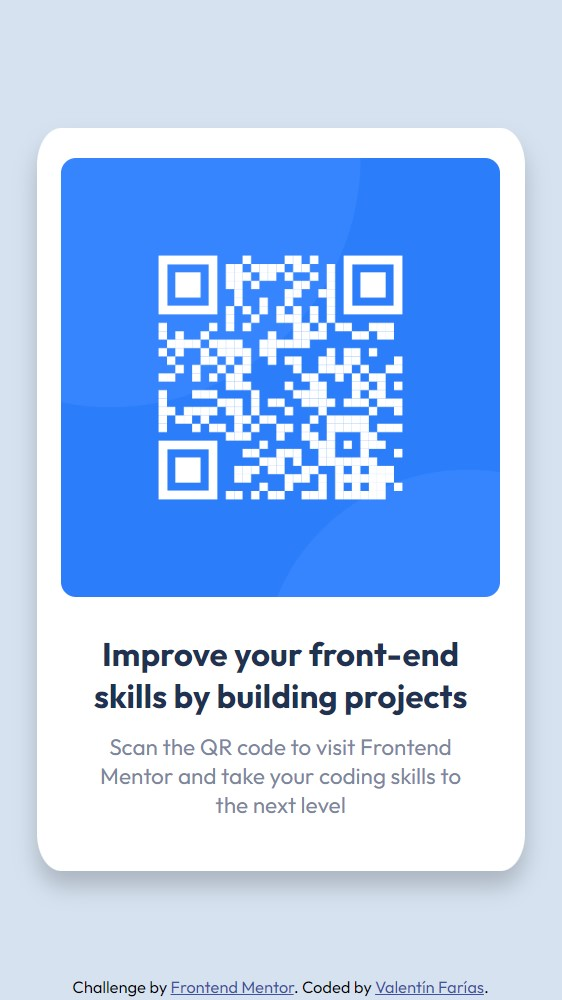
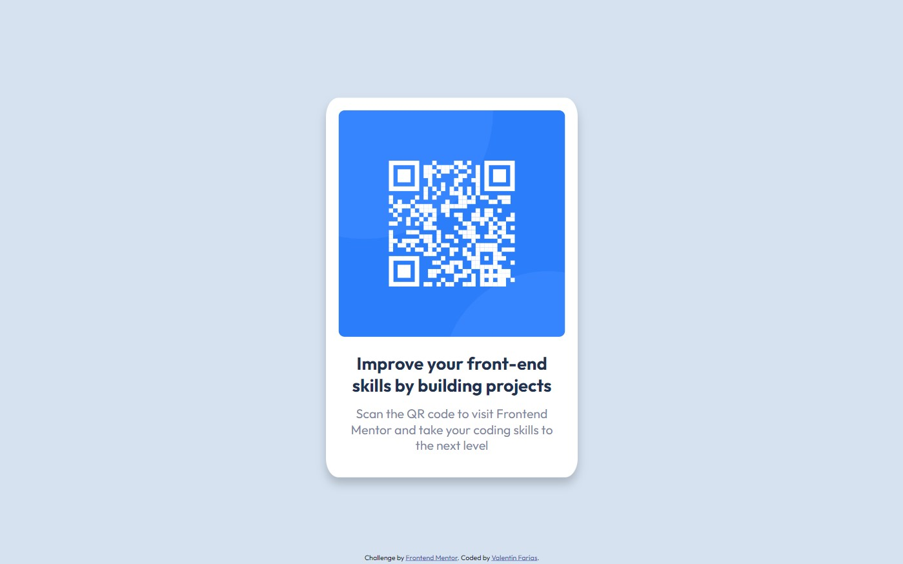

# Frontend Mentor - QR code component solution

This is a solution to the [QR code component challenge on Frontend Mentor](https://www.frontendmentor.io/challenges/qr-code-component-iux_sIO_H). Frontend Mentor challenges help you improve your coding skills by building realistic projects.

## Table of contents

- [Overview](#overview)
  - [Screenshot](#screenshot)
  - [Links](#links)
- [My process](#my-process)
  - [Built with](#built-with)
  - [Continued development](#continued-development)
  - [Useful resources](#useful-resources)
- [Author](#author)

## Overview

### Screenshot

**Mobile:**

**Desktop:**

### Links

- Solution URL: [link](https://github.com/Nelav99/Qr-challenge-FrontEnd-Mentor.git)
- Live Site URL: [link](https://nelav99.github.io/Qr-challenge-FrontEnd-Mentor/)

## My process

### Built with

- Semantic HTML5 markup
- CSS custom properties
- Flexbox
- Mobile-first workflow

### Continued development

I will continue working to perfect my skills in HTML, CSS, Javascript and React Js. In addition, I will create more challenges and projects to enrich my portfolio.

### Useful resources

- [HTML & CSS Path (Spanish)](https://platzi.com/web-frontend/?school=_escuela_escuela-web_)
- This is an amazing learning path, which helped me finally understand HTML, CSS (grid and flexbox). I would recommend it to anyone who is still learning these concepts.

- [HTML for Beginners (English)](https://www.youtube.com/watch?v=kUMe1FH4CHE)
- This is an amazing video, which helped me understand HTML. I would recommend it to anyone person who is start learning these concepts. So you can learn HTML5, semantic HTML, tags, and more.

- [CSS for Beginners (English)](https://www.youtube.com/watch?v=OXGznpKZ_sA)
- This is an amazing video, which helped me understand CSS, Flexbox and CSS Grid. I would recommend it to anyone who is still learning these concepts.

## Author

- Website - [GitHub](https://github.com/Nelav99)
- Frontend Mentor - [@Nelav99](https://www.frontendmentor.io/profile/Nelav99)
- Linkedin - [Profile](https://www.linkedin.com/in/valent%C3%ADn-far%C3%ADas-aa0282147)
